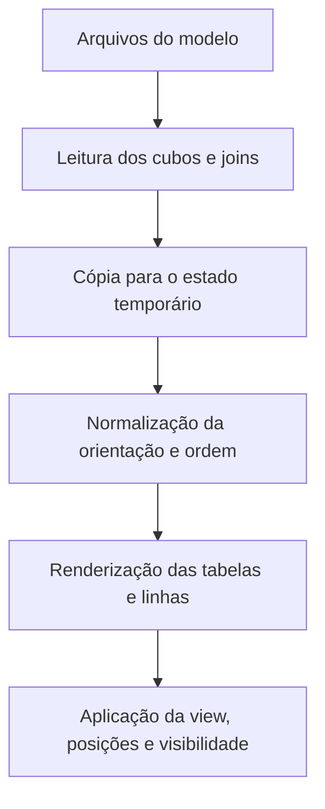

# Editor visual de modelo pelo diagrama

Este documento descreve o funcionamento atual do editor visual de modelos Cube pelo diagrama de relacionamentos. Ele serve como referência para validar se o comportamento implementado corresponde ao fluxo esperado.

## 1. Conceitos fundamentais

O editor trabalha com dois estados diferentes:

1. **Estado persistido do modelo**: os arquivos `.yml`, `.yaml` ou `.js` que definem os cubos.
2. **Estado temporário do diagrama**: uma cópia em memória do modelo carregado, usada enquanto o diagrama está aberto.

O arquivo `.cube-diagram.json` não é a fonte da verdade do modelo. Ele armazena somente preferências de visualização:

- views do diagrama;
- cubos visíveis ou ocultos em cada view;
- posição dos cubos;
- nome e cor de fundo das views.

Os identificadores `diagramItemId` usados nas dimensões, medidas e hierarquias são temporários. Eles ajudam a manipular itens duplicados dentro da tela e não são gravados no arquivo do Cube.

## 2. Abertura do diagrama

O fluxo esperado é:



### 2.1 Lock do projeto

Antes de carregar o modelo, o navegador tenta adquirir um lock:

```text
POST /playground/schema/lock
```

O lock:

- é exclusivo por projeto/datamart;
- possui TTL de 90 segundos;
- é renovado a cada 30 segundos por heartbeat;
- é liberado ao fechar o diagrama;
- coloca a tela em somente leitura quando pertence a outra sessão ou expira.

O token é enviado em `X-Cube-Project-Lock`.

### 2.2 Leitura do modelo

O diagrama consulta:

```text
GET /playground/schema/relationships
GET /playground/schema/diagram-state
```

O primeiro endpoint retorna cubos, títulos, tipo de arquivo, origem SQL/tabela, dimensões, medidas, hierarquias, colunas físicas e relacionamentos.

Views do Cube não são exibidas como tabelas do diagrama.

O segundo endpoint retorna preferências visuais persistidas em `.cube-diagram.json`. Se não houver estado no servidor, o navegador utiliza o estado local disponível como fallback.

Por padrão, a abertura inicia na **Visão principal**.

## 3. Estado temporário

O estado temporário possui esta estrutura conceitual:

```ts
{
  cubes: [
    {
      name: 'tf_exemplo',
      title: 'Fato - Exemplo',
      dimensions: [],
      measures: [],
      hierarchies: [],
      columns: []
    }
  ],
  relationships: [
    {
      sourceCube: 'tf_exemplo',
      targetCube: 'td_periodo',
      sourceColumn: 'dt_evento',
      targetColumn: 'data',
      sourceColumns: ['dt_evento'],
      targetColumns: ['data'],
      relationship: 'many_to_one',
      sql: '{CUBE.dt_evento} = {td_periodo.data}'
    }
  ]
}
```

Esse estado é a fonte usada para renderizar cubos, colunas, dimensões, medidas, hierarquias, joins, cardinalidades e ordem das dimensões.

Uma alteração feita na tela deve alterar esse estado e provocar a renderização do diagrama completo novamente.

## 4. Normalização ao abrir

Antes da renderização, o editor pode normalizar o estado temporário.

### 4.1 Orientação dos relacionamentos

O Cube armazena preferencialmente a relação no lado “muitos” usando `many_to_one`.

Quando é encontrado um relacionamento `one_to_many` com colunas explícitas, o editor o transforma para a orientação equivalente:

```text
one_to_many A -> B
```

é convertido para:

```text
many_to_one B -> A
```

Essa alteração fica pendente para ser persistida no arquivo quando o usuário salvar.

### 4.2 Ordem inicial das dimensões

A ordem canônica é:

1. dimensões marcadas como `primary_key`;
2. dimensões usadas em joins;
3. dimensões comuns que participam da expressão da chave primária;
4. dimensões não usadas em joins.

Depois das dimensões aparecem hierarquias, medidas e colunas físicas que não foram usadas em nenhuma especificação do cubo.

A chave composta não é uma dimensão. Ela é uma característica do relacionamento entre cubos.
Da mesma forma, uma dimensão física usada na expressão de uma chave primária
composta continua sendo uma dimensão comum; ela apenas pertence ao grupo de
componentes da chave primária para fins de ordenação.

## 5. Chaves e joins

### 5.1 Chave primária

Uma dimensão com `primary_key: true` aparece no primeiro grupo do cubo.

Uma dimensão como esta pode representar a chave primária composta do cubo:

```yaml
- name: id
  sql: CONCAT({CUBE}.flight_id, '-', {CUBE}.ticket_no)
  primary_key: true
```

Isso não transforma `flight_id` ou `ticket_no` em dimensões compostas.

### 5.2 Join simples

Um join simples usa uma coluna em cada lado:

```yaml
sql: "{CUBE.sk_premio_status} = {td_premio_status.sk_premio_status}"
```

Ao criar ou atualizar um join pelo editor visual, o cubo que contém a seção
`joins` é sempre tratado como `{CUBE}`. Portanto, mesmo que o usuário inicie o
arraste pelo outro cubo, o estado armazenado fica no formato:

```yaml
sql: "{CUBE.DATA} = {td_periodo.DATA}"
```

O nome técnico do cubo armazenador não deve ser escrito no lado esquerdo do SQL.

`sk_premio_status` pertence ao grupo de dimensões usadas em joins simples. O mesmo vale para:

```yaml
sql: "{CUBE.dt_sorteio} = {td_periodo.data}"
```

Portanto, essas duas dimensões podem ser reordenadas entre si.

### 5.3 Join composto

Um join composto usa duas ou mais colunas em cada lado:

```yaml
sql: "{CUBE.flight_id} = {segments.flight_id} AND {CUBE.ticket_no} = {segments.ticket_no}"
```

Nesse caso:

- o relacionamento é composto;
- `flight_id` e `ticket_no` pertencem ao grupo de dimensões usadas no join composto;
- nenhuma dessas dimensões é marcada automaticamente como “chave composta”.

### 5.4 Cardinalidades

| Opção | Cardinalidade visual | Forma preferencial gravada |
|---|---:|---|
| Um para um | 1:1 | `one_to_one` |
| Muitos para um | N:1 | `many_to_one` |
| Um para muitos | 1:N | invertida para o lado muitos e gravada como `many_to_one` |

O Cube não aceita relacionamentos muitos-para-muitos no editor.

### 5.5 Renderização das linhas

As linhas são derivadas de `temporarySchemaSnapshot.relationships`. Elas não são uma fonte separada de dados.

Cada linha possui cubo de origem, cubo de destino, coluna de origem, coluna de destino, cardinalidade e identificador visual temporário.

O React Flow recalcula os pontos dos handles depois que os cubos são renderizados. A posição dos cubos altera somente a geometria da linha; não altera o relacionamento no estado temporário.

## 6. Conteúdo de cada cubo

O cabeçalho mostra título, nome técnico, tipo de arquivo (`YAML` ou `JS`) e menu de ações. O SQL da tabela não é exibido no cabeçalho.

As linhas mostram nome amigável ou título, nome técnico quando diferente, tipo e indicadores de chave/relacionamento.

Dimensões duplicadas não são deduplicadas pelo diagrama. Cada ocorrência existente no modelo continua visível para permitir correção manual. O `diagramItemId` diferencia as ocorrências somente durante a edição.

## 7. Edição de dimensões, medidas e hierarquias

Ao abrir um formulário e salvar:

1. o formulário valida os campos básicos;
2. a alteração é aplicada ao estado temporário;
3. a alteração é adicionada à lista de mudanças pendentes;
4. referências dependentes são atualizadas no estado temporário;
5. o diagrama é renderizado novamente a partir do estado atualizado.

### 7.1 Dimensões

É possível criar dimensão a partir de uma coluna, editar, excluir, marcar como chave primária e alterar título, SQL, tipo, descrição e propriedades adicionais.

Ao criar uma dimensão a partir de uma coluna, o nome técnico padrão é o nome físico da coluna em lowercase. `Ctrl + Enter` salva o formulário interno.

Ao renomear uma dimensão, o editor atualiza no estado temporário:

- níveis de hierarquias que a referenciam;
- nomes de colunas do relacionamento quando aplicável;
- referências SQL simples do relacionamento.

### 7.2 Medidas

É possível criar medida a partir de uma coluna, editar, excluir e mover medida para cima ou para baixo dentro do grupo de medidas.

### 7.3 Hierarquias

É possível criar, editar e excluir hierarquias, alterar seus níveis e movê-las para cima ou para baixo dentro do grupo de hierarquias.

## 8. Reordenação

A reordenação é feita no estado temporário. O editor não permite atravessar grupos diferentes.

Para dimensões, os grupos são:

```text
primary
join
primary key components
regular
```

Assim:

- uma dimensão de join simples pode trocar de posição com outra dimensão de join simples;
- uma dimensão de join composto pode trocar de posição com outra dimensão usada em join;
- componentes da mesma chave primária podem trocar de posição entre si;
- uma dimensão usada em join não atravessa um componente de chave primária;
- um componente de chave primária não atravessa uma dimensão normal;
- a chave primária permanece no primeiro grupo.

Medidas e hierarquias podem ser reordenadas somente dentro da própria seção.

## 9. Busca, visibilidade e views

### 9.1 Busca

A busca filtra visualmente os cubos cujo nome, título ou coluna corresponde ao texto.

A busca não deve alterar expansão de árvores, visibilidade persistida da view, posições ou o estado temporário do modelo.

### 9.2 Views

Cada view possui identificador, nome, cor pastel de fundo, visibilidade individual dos cubos e posição individual dos cubos.

A **Visão principal** é criada automaticamente, abre por padrão e não pode ser renomeada ou excluída. As demais views podem ser criadas, editadas e excluídas.

Ao trocar de view, a posição e a visibilidade da view atual são capturadas antes da mudança. Em seguida, a nova view é carregada e o diagrama é renderizado com suas próprias posições e visibilidade.

### 9.3 Tabela de visibilidade

A tabela lateral é a fonte visual da visibilidade dos cubos. Cada linha permite:

- mostrar ou ocultar cubo;
- isolar o cubo e seus vizinhos diretos;
- dar zoom no cubo.

Isolar um cubo altera a visibilidade da view atual. Não cria uma nova view automaticamente.

## 10. Posições e zoom

Arrastar um cubo altera sua posição no React Flow, a posição da view atual e o estado visual salvo em `.cube-diagram.json`.

Arrastar um cubo não altera YAML/JS, dimensões, medidas, joins ou ordem das colunas.

O zoom e o pan pertencem à sessão visual do diagrama. Salvar o modelo não deve recalcular o viewport nem reconstruir o diagrama a partir do servidor.

## 11. Salvamento

| Ação | Atalho | Comportamento |
|---|---|---|
| Cancelar | `Shift + Enter` | descarta a edição da sessão e fecha |
| Salvar | `Ctrl + Enter` | valida e salva a estrutura, mantendo o diagrama aberto |
| Salvar e fechar | `Ctrl + Shift + Enter` | valida, salva e fecha |

O `Ctrl + Enter` de um formulário interno salva apenas o formulário e não propaga o evento para o modal principal.

### 11.1 Comparação antes de salvar

O editor gera um snapshot do estado temporário e compara com o snapshot original:

```text
snapshot original dos arquivos
snapshot temporário atual
```

Se forem iguais, nenhum arquivo de modelo é substituído. O estado visual pode ser persistido e a mensagem informa que não há alteração na estrutura.

Se forem diferentes:

1. o estado visual é persistido;
2. o snapshot completo dos cubos é enviado ao servidor;
3. o servidor valida o lock;
4. valida a existência dos cubos e joins;
5. gera os arquivos de origem com o conversor correspondente;
6. compila e valida o estado final do modelo;
7. grava os arquivos somente se a validação passar;
8. mantém o estado temporário na tela, sem chamar novamente o carregamento do diagrama.

O endpoint usado para o snapshot é:

```text
POST /playground/schema/snapshot
```

O snapshot precisa conter o estado completo dos joins de cada cubo. O servidor rejeita um snapshot sem a lista de `joins`.

### 11.2 Mensagens

Mensagens esperadas:

- `Estrutura de dados salva`;
- `Nenhuma alteração na estrutura de dados para salvar`;
- mensagem detalhada retornada pela validação do Cube;
- mensagem de lock expirado ou pertencente a outra sessão.

## 12. Cancelamento

Cancelar fecha o editor e descarta o estado temporário da sessão atual. Não deve escrever alterações nos arquivos de modelo.

As posições e visibilidades que já tenham sido persistidas no estado visual não fazem parte do YAML/JS do modelo.

## 13. Validação do modelo

O servidor valida o estado final, e não uma sequência de operações individuais. Isso permite renomear uma dimensão, atualizar referências no estado temporário, remover a dimensão antiga e salvar somente o resultado final.

Se o estado final for inválido, nenhum arquivo deve ser considerado salvo. A mensagem deve indicar arquivo, cubo, seção e motivo retornado pelo compilador.

Exemplos:

```text
Member names must be unique within a cube
```

```text
Invalid relationship change
```

O texto de erro deve ser exibido em UTF-8, sem conversões intermediárias de encoding.

## 14. Diagnóstico pelo console

Com o diagrama aberto, o frontend expõe uma função somente para leitura:

```js
cubeDiagramDebug()
```

Também é possível consultar somente um cubo:

```js
cubeDiagramDebug('tf_partic_ent_indicacoes')
```

O retorno contém:

- `temporarySchemaSnapshot`: cubos e relacionamentos atualmente usados para renderizar;
- `originalSchemaSnapshot`: snapshot carregado dos arquivos ao abrir o diagrama;
- `pendingChanges`: alterações locais ainda não persistidas;
- `renderedNodes`: posições e visibilidade dos cubos renderizados;
- `renderedEdges`: handles efetivamente usados pelas linhas;
- `relationshipDiagnostics`: colunas declaradas, colunas físicas resolvidas, dimensão correspondente e handles de origem/destino.

Para um relacionamento simples entre `DATA` e `DATA`, o diagnóstico esperado é semelhante a:

```js
{
  sourceColumn: 'DATA',
  targetColumn: 'DATA',
  sourceColumns: ['DATA'],
  targetColumns: ['DATA'],
  sourceDimension: 'data',
  targetDimension: 'data',
  sourceHandle: 'source:right:DATA',
  targetHandle: 'target:left:DATA'
}
```

Se aparecer `sourceHandle: 'source:right:__cube'`, a coluna de origem não foi
resolvida e a linha será desenhada no handle do cabeçalho. Isso indica problema
na leitura do SQL do relacionamento ou na correspondência entre coluna física
e dimensão.

## 15. Pontos que precisam ser validados

### 15.1 Segmentos e pré-agregações

Os formulários de segmentos e pré-agregações existem, mas o snapshot usado pelo salvamento principal contém explicitamente:

```text
cube
dimensions
measures
hierarchies
joins
```

Segmentos e pré-agregações não estão representados no `DiagramCube` nem no `schemaSnapshotForSave`. É necessário confirmar se a intenção é incluí-los no estado temporário e no snapshot ou mantê-los fora do escopo do editor via diagrama.

### 15.2 Edição de joins compostos

Joins compostos existentes são lidos com `sourceColumns` e `targetColumns`. Entretanto, o formulário atual seleciona uma única coluna de origem e uma única coluna de destino.

É necessário confirmar se o comportamento esperado é somente visualizar joins compostos ou também editá-los e criá-los diretamente pelo diagrama. Para a segunda opção, o formulário precisa permitir múltiplas condições, por exemplo:

```text
flight_id = flight_id
ticket_no = ticket_no
```

### 15.3 Indicador visual de chave

O ícone de chave usa estes tooltips:

- `Chave primária`;
- `Chave de junção`;
- `Componente de chave primária`.

Quando uma coluna exerce mais de um papel, `Chave de junção` tem prioridade
visual e de ordenação sobre `Componente de chave primária`.

## 16. Checklist de validação funcional

### Abertura

- [ ] O diagrama abre na Visão principal.
- [ ] Todos os cubos esperados aparecem.
- [ ] Views não aparecem como cubos.
- [ ] Os joins existentes aparecem imediatamente.
- [ ] As linhas são renderizadas a partir do estado temporário.
- [ ] Recarregar a página cria uma nova cópia temporária a partir dos arquivos.

### Estado temporário

- [ ] Editar uma dimensão altera imediatamente o cubo na tela.
- [ ] Renomear uma dimensão atualiza joins e hierarquias dependentes.
- [ ] Excluir uma dimensão não a recria ao salvar.
- [ ] Mover uma dimensão altera a ordem no estado temporário.
- [ ] Mover uma dimensão não altera joins.
- [ ] Alterar posição de cubo não altera o modelo.

### Joins

- [ ] Joins simples e compostos aparecem no grupo de chaves de junção.
- [ ] `sk_premio_status` e `dt_sorteio` podem trocar de ordem quando pertencem ao mesmo cubo.
- [ ] Componentes de chave primária ficam abaixo das chaves de junção.
- [ ] Uma coluna que é componente da PK e chave de junção é classificada como chave de junção.
- [ ] Um join composto como `(flight_id, ticket_no)` não é tratado como uma dimensão.
- [ ] A cardinalidade exibida corresponde ao YAML/JS.
- [ ] A orientação `one_to_many` é normalizada sem perder a relação.

### Views

- [ ] A Visão principal não pode ser renomeada.
- [ ] A Visão principal não pode ser excluída.
- [ ] Cada view mantém visibilidade própria.
- [ ] Cada view mantém posições próprias.
- [ ] Cada view utiliza uma cor pastel própria.
- [ ] Isolar cubo altera somente a view atual.

### Salvamento

- [ ] `Ctrl + Enter` salva sem fechar.
- [ ] `Ctrl + Shift + Enter` salva e fecha.
- [ ] Salvar não chama `loadDiagram()`.
- [ ] Salvar não remove linhas do diagrama.
- [ ] O snapshot enviado contém todos os joins.
- [ ] O servidor valida o estado final completo.
- [ ] Erros detalhados são exibidos em UTF-8.
- [ ] Em caso de erro, os arquivos permanecem inalterados.

### Concorrência

- [ ] A primeira sessão obtém o lock.
- [ ] A segunda sessão entra em somente leitura.
- [ ] O heartbeat mantém o lock ativo.
- [ ] Após expiração, o salvamento é bloqueado.
- [ ] Ao fechar, o lock é liberado.
