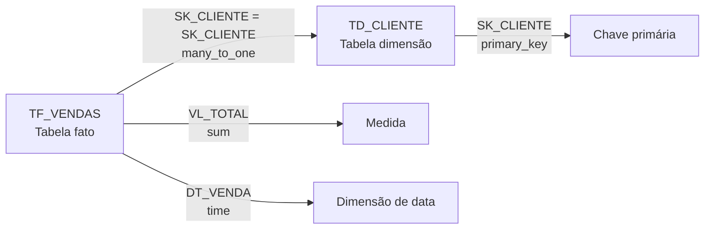
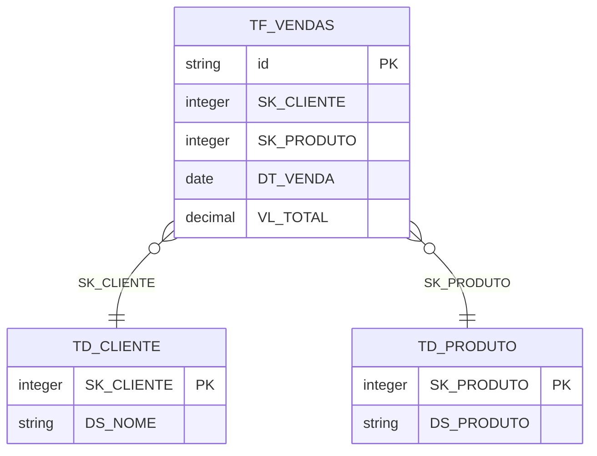

# Padrão corporativo de modelagem dimensional

Este documento define as convenções usadas pelo gerador de modelos de dados do
Cube para classificar tabelas, colunas, medidas, dimensões, chaves e
relacionamentos.

O padrão foi criado para bancos que seguem a nomenclatura dimensional
corporativa baseada em tabelas fato (`TF`) e dimensão (`TD`). Os nomes são
avaliados sem distinção entre maiúsculas e minúsculas.

## Visão geral



As regras principais são:

| Elemento | Convenção | Resultado padrão |
| --- | --- | --- |
| Tabela fato | Nome começa com `TF` | Cubo de fatos |
| Tabela dimensão | Nome começa com `TD` | Cubo de dimensão |
| Chave substituta | Coluna começa com `SK` | Dimensão de chave |
| Métrica de valor | Coluna numérica começa com `VL` ou `VLR` | Medida `sum` |
| Métrica de quantidade | Coluna numérica começa com `QT` ou `QTD` | Medida `sum` |
| Descrição | Coluna começa com `DS` | Dimensão |
| Flag | Coluna começa com `FL` | Dimensão |
| Data | Coluna começa com `DT` | Dimensão do tipo `time` |
| Texto restante | Coluna textual sem outra classificação | Dimensão |

## Classificação das tabelas

### Tabelas fato

Tabelas cujo nome começa com `TF` representam eventos, transações ou fatos
mensuráveis. Exemplos:

```text
TF_VENDAS
TF_FATURAMENTO
TF_MOVIMENTO_ESTOQUE
```

As colunas numéricas de negócio da tabela fato normalmente são geradas como
medidas. As chaves estrangeiras `SK_*` permanecem disponíveis como dimensões
para permitir filtros, agrupamentos e relacionamentos.

### Tabelas dimensão

Tabelas cujo nome começa com `TD` representam o contexto descritivo dos fatos.
Exemplos:

```text
TD_CLIENTE
TD_PRODUTO
TD_ESTABELECIMENTO
```

Se uma tabela `TF` tiver uma ou mais colunas `SK_*`, o gerador criará uma única
dimensão técnica, normalmente chamada `id`, com uma expressão `CONCAT` de
todas as `SK_*`. Somente essa dimensão será marcada como `primary_key: true`.
As dimensões originais `SK_*` continuam disponíveis para filtros e joins, mas
não são marcadas individualmente como chave primária.

Se uma tabela `TD` tiver uma ou mais colunas `SK_*`, a primeira `SK` na ordem
retornada pelo banco será criada como chave primária simples do cubo gerado.
As demais `SKs` continuam como dimensões comuns.

## Classificação das colunas

### Chaves `SK_*`

Toda coluna cujo nome começa com `SK` é considerada chave. O separador `_` é
opcional para a identificação:

```text
SK_CLIENTE
SK_PRODUTO
SK_ESTABELECIMENTO
SKCLIENTE
```

Em uma tabela `TD`, a primeira `SK` recebe `primary_key: true`. Por exemplo:

```yaml
dimensions:
  - name: sk_cliente
    sql: ${CUBE}.SK_CLIENTE
    type: number
    primary_key: true
```

### Medidas `VL`, `VLR`, `QT` e `QTD`

Colunas numéricas que começam com um dos prefixos abaixo são criadas como
medidas com agregação padrão `sum`:

```text
VL_TOTAL
VLR_IMPOSTO
QT_ITENS
QTD_HORAS
```

Exemplo do resultado gerado:

```yaml
measures:
  - name: vl_total
    sql: ${CUBE}.VL_TOTAL
    type: sum
```

O prefixo só classifica a coluna como medida quando o tipo do banco é
numérico. Uma coluna textual chamada `VL_DESCRICAO`, por exemplo, não será
tratada como medida.

### Descrições `DS_*`

Colunas que começam com `DS` são tratadas como dimensões descritivas:

```text
DS_CLIENTE
DS_NOME_PRODUTO
DS_MUNICIPIO
```

### Flags `FL_*`

Colunas que começam com `FL` são tratadas como dimensões, independentemente de
serem representadas como booleano, texto ou número no banco:

```text
FL_ATIVO
FL_CANCELADO
FL contribuinte
```

O nome recomendado é `FL_ATIVO`, sem espaço, mas a classificação considera o
prefixo normalizado.

### Datas `DT_*`

Colunas que começam com `DT` são geradas como dimensões do tipo `time`:

```text
DT_VENDA
DT_INICIO_VIGENCIA
DT_ATUALIZACAO
```

Colunas que o driver já identifica como data ou hora também continuam sendo
tratadas como dimensões de tempo, mesmo que não tenham o prefixo `DT`.

### Chave de `TD_PERIODO`

Quando `TD_PERIODO` não possui nenhuma coluna `SK` e possui uma coluna chamada
`DATA`, o gerador usa `DATA` como `primary_key` da dimensão.

Nas tabelas fato, o primeiro atributo cujo nome começa com `DT` é ligado por
padrão a `TD_PERIODO.DATA`, gerando um relacionamento `many_to_one`:

```text
TF_VENDAS.DT_VENDA = TD_PERIODO.DATA
```

Esse relacionamento automático só é aplicado quando `TD_PERIODO` não possui
`SK`. Se a dimensão tiver `SK`, continuam valendo as regras de relacionamento
por chave substituta.

### Outras colunas textuais

Em tabelas corporativas (`TF` ou `TD`), colunas textuais que não foram
classificadas como medida ou chave são geradas como dimensões. Isso inclui,
por exemplo:

```text
NM_CLIENTE
TP_PESSOA
COD_UF
```

## Relacionamentos entre `TF` e `TD`

O padrão esperado é:

```text
TF.<SK_DA_TF> = TD.<PRIMEIRA_SK>
```

Para tabelas `TD` com mais de uma `SK`, o destino do relacionamento automatico
e sempre a primeira `SK` na ordem retornada pelo banco, pois ela e a
`primary_key` da dimensao. As demais `SKs` da `TD` nao podem ser usadas como
destino desse relacionamento.

O relacionamento é gerado como `many_to_one`:

- muitas linhas da tabela fato (`TF`) apontam para uma linha da dimensão (`TD`);
- a tabela fato é o lado muitos;
- a tabela dimensão é o lado um.



Para que o relacionamento automático seja encontrado, a tabela `TD` precisa
estar entre as tabelas selecionadas para a geração e deve ser identificável por
uma destas condições:

1. possuir a primeira `SK` com o mesmo nome da chave da `TF`; ou
2. ter nome compatível com a chave primaria, como `SK_CLIENTE` e `TD_CLIENTE`.

Exemplo:

```text
TF_VENDAS.SK_CLIENTE = TD_CLIENTE.SK_CLIENTE
TF_VENDAS.SK_PRODUTO = TD_PRODUTO.SK_PRODUTO
```

Por exemplo, se `TD_MUNICIPIO` possuir `SK_MUNICIPIO` e
`SK_REGIAO_FISCAL`, a primeira coluna e a chave primaria. Mesmo que a `TF`
tambem possua as duas colunas, o join correto e:

```text
TF_MOVIMENTO.SK_MUNICIPIO = TD_MUNICIPIO.SK_MUNICIPIO
```

A coluna `TF_MOVIMENTO.SK_REGIAO_FISCAL` nao deve gerar um segundo join para
`TD_MUNICIPIO`, porque `SK_REGIAO_FISCAL` e uma `SK` secundaria nessa TD.

O YAML correspondente fica semelhante a:

```yaml
joins:
  - name: td_municipio
    sql: ${CUBE}.SK_MUNICIPIO = ${td_municipio}.SK_MUNICIPIO
    relationship: many_to_one
```

O YAML gerado fica semelhante a:

```yaml
cubes:
  - name: tf_vendas
    sql_table: DW.TF_VENDAS
    joins:
      - name: td_cliente
        sql: ${CUBE}.SK_CLIENTE = ${td_cliente}.SK_CLIENTE
        relationship: many_to_one
      - name: td_produto
        sql: ${CUBE}.SK_PRODUTO = ${td_produto}.SK_PRODUTO
        relationship: many_to_one
```

Se o banco fornecer metadados explícitos de chave estrangeira, eles continuam
sendo considerados pelo gerador. Para tabelas que não seguem o padrão `TF`/`TD`,
o comportamento anterior de inferência de relacionamentos é preservado.

## Exemplo completo

### Estrutura física

```text
DW.TF_VENDAS
├── SK_CLIENTE          INTEGER
├── SK_PRODUTO          INTEGER
├── DT_VENDA            DATE
├── VL_TOTAL            DECIMAL(18,2)
├── QT_ITENS            INTEGER
├── FL_CANCELADA        BOOLEAN
└── DS_OBSERVACAO       VARCHAR

DW.TD_CLIENTE
├── SK_CLIENTE          INTEGER
├── DS_NOME             VARCHAR
├── DS_MUNICIPIO        VARCHAR
└── FL_ATIVO            BOOLEAN
```

### Resultado esperado

```yaml
# tf_vendas.yml
cubes:
  - name: tf_vendas
    sql_table: DW.TF_VENDAS

    joins:
      - name: td_cliente
        sql: ${CUBE}.SK_CLIENTE = ${td_cliente}.SK_CLIENTE
        relationship: many_to_one

    dimensions:
      - name: id
        sql: CONCAT(${CUBE}.SK_CLIENTE, '-', ${CUBE}.SK_PRODUTO)
        type: string
        primary_key: true
      - name: sk_cliente
        sql: ${CUBE}.SK_CLIENTE
        type: number
      - name: sk_produto
        sql: ${CUBE}.SK_PRODUTO
        type: number
      - name: dt_venda
        sql: ${CUBE}.DT_VENDA
        type: time
      - name: fl_cancelada
        sql: ${CUBE}.FL_CANCELADA
        type: boolean
      - name: ds_observacao
        sql: ${CUBE}.DS_OBSERVACAO
        type: string

    measures:
      - name: count
        type: count
      - name: vl_total
        sql: ${CUBE}.VL_TOTAL
        type: sum
      - name: qt_itens
        sql: ${CUBE}.QT_ITENS
        type: sum
```

```yaml
# td_cliente.yml
cubes:
  - name: td_cliente
    sql_table: DW.TD_CLIENTE

    dimensions:
      - name: sk_cliente
        sql: ${CUBE}.SK_CLIENTE
        type: number
        primary_key: true
      - name: ds_nome
        sql: ${CUBE}.DS_NOME
        type: string
      - name: ds_municipio
        sql: ${CUBE}.DS_MUNICIPIO
        type: string
      - name: fl_ativo
        sql: ${CUBE}.FL_ATIVO
        type: boolean

    measures:
      - name: count
        type: count
```

## Regras de prioridade

Quando uma coluna se encaixa em mais de uma categoria, o gerador aplica a
seguinte prioridade prática:

1. `SK_*`: dimensão de chave; em `TF`, todas as `SK_*` compõem uma única dimensão primária; em `TD`, a primeira `SK` é a chave primária;
2. `TD_PERIODO.DATA` sem `SK`: chave primária da dimensão de período;
3. `DT_*` ou tipo de data/hora: dimensão de tempo;
4. `VL*`, `VLR*`, `QT*` ou `QTD*` numérico: medida `sum`;
5. `DS_*`: dimensão descritiva;
6. `FL_*`: dimensão de flag;
7. demais colunas textuais: dimensão.

Por isso, uma coluna `SK_PRODUTO` numérica não vira medida, mesmo que o tipo
seja numérico. Ela é tratada como chave.

## Checklist para criação de tabelas

Antes de gerar o modelo, confirme:

- [ ] tabelas fato começam com `TF`;
- [ ] tabelas dimensão começam com `TD`;
- [ ] chaves substitutas começam com `SK`;
- [ ] em cada `TD` com uma ou mais `SK`, somente a primeira `SK` na ordem do banco é a chave primária;
- [ ] medidas de valor usam `VL` ou `VLR`;
- [ ] medidas de quantidade usam `QT` ou `QTD`;
- [ ] datas usam `DT`;
- [ ] descrições usam `DS`;
- [ ] flags usam `FL`;
- [ ] as tabelas fato e dimensão relacionadas são selecionadas juntas;
- [ ] os nomes das chaves da `TF` e da `TD` são compatíveis.
- [ ] o join automatico aponta para a primeira `SK` da `TD`, nunca para uma `SK` secundaria;
- [ ] `TD_PERIODO` sem `SK` possui a coluna `DATA`;
- [ ] o primeiro `DT_*` da `TF` representa a data usada no relacionamento com `TD_PERIODO`;

## Escopo do gerador

O padrão é aplicado quando o usuário usa **Gerar modelo de dados** no
playground. A geração considera somente as tabelas selecionadas na árvore.

Tabelas que não começam com `TF` ou `TD` continuam usando as regras legadas do
gerador, incluindo a inferência tradicional de dimensões, medidas e
relacionamentos.
